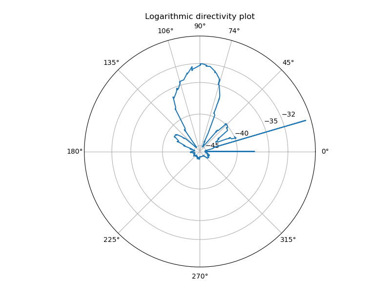

# Antenna gain plot measurement script

This script (`main.py`) measures the gain plot of an antenna mounted on a rotator using a fixed-frequency beacon and an RTL-SDR.

For measuring received power, the program `power_meter.c` is used that reads IQ samples from STDIN, uses an IF of 200 kHz and low pass filters the value (using averaging over 1s, a very crude method).

The script controls the antenna rotator over TCP using the `rotctld` protocol. The data is saved into a CSV file.

The script `plot_antenna.py` plots the data as a polar gain plot.

The scripts are provided as-is, and the previous `plot_power_over_time` script that was first developed for QRM hunting is also provided.

The data file `data_435_360_mhz_2025_03_14_beacon_20db_att.csv` has the measurement data from our 70cm helix antenna. Results are shown below.

